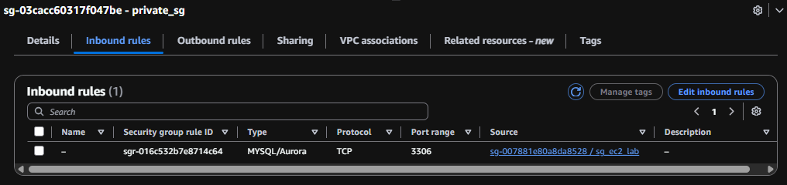
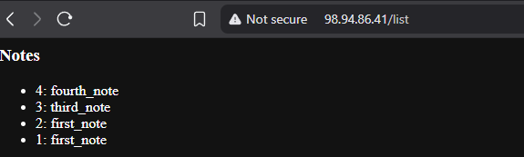
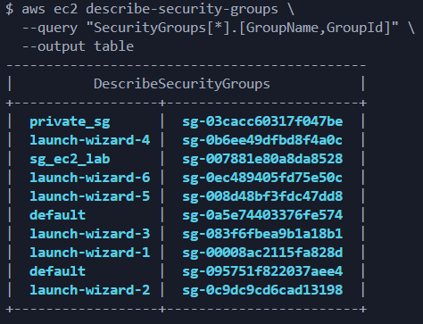
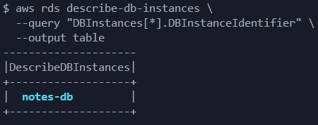
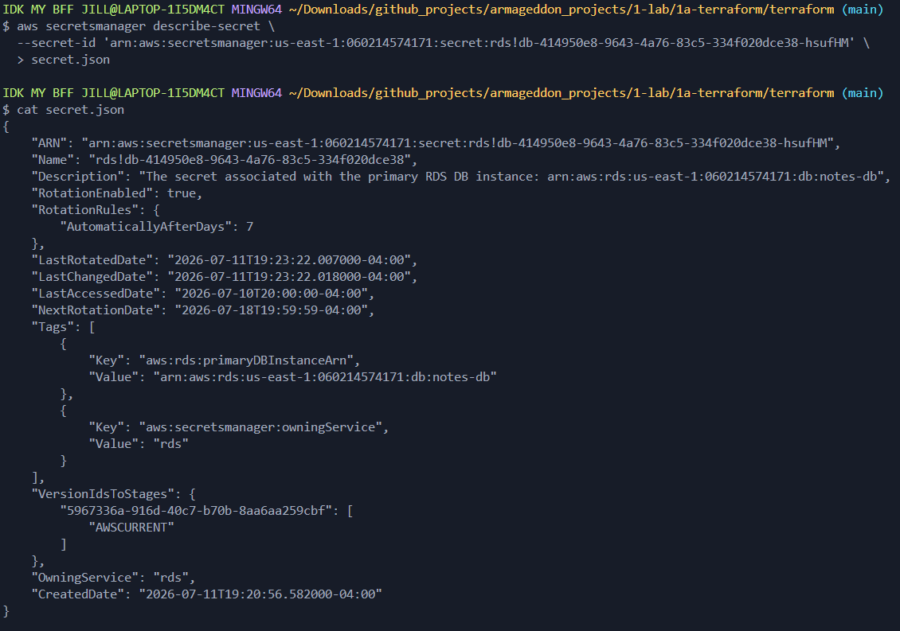

# Deliverables

1.
    - Screenshot of: RDS SG inbound rule using source = sg-ec2-lab
    

    - Screenshot of: EC2 role attached
    
    - Screenshot(2) of: EC2 role attached
    .png)

    - Screenshot of: /list output showing at least 3 notes  
    

2.  
    a) Why is DB inbound source restricted to the EC2 security group?  
        so that only the application server can connect to the database  

    b) What port does MySQL use?  
        MySQL uses TCP port 3306  

    c) Why is Secrets Manager better than storing creds in code/user-data?  
        because credentials are encrypted, can be rotated automatically, and are not exposed in repositories, EC2 metadata, or configuration files

3. Evidence for Audits / Labs (CLI Outputs)  
    - aws ec2 describe-security-groups  
    
    - aws rds describe-db-instances  
    
    - aws secretsmanager describe-secret
    
    - aws ec2 describe-instances
    
    - aws iam list-attached-role-policies
    

Then Answer: Response  

1. Why each rule exists  
2. What would break if removed  
3. Why broader access is forbidden  
4. Why this role exists  
5. Why it can read this secret  
6. Why it cannot read others

```s
Public Subnet  

    1. Why each rule exists  
subnet resources do not create permissions,they define the network layout, this public subnet exist because the database should never be directly reachable from the internet and only the EC2 application should communicate with it

    2. What would break if removed  
the ec2 instance would have nowhere to be deployed, without the public subnet the ec2 could not exist inside the VPC

    3. Why broader access is forbidden  
following principle of least privilege, not placing databases onto public networks decreases attack surface

    4. Why this role exists
subnet resources do not grant identities or permissions, no IAM Role is created here

    5. Why it can read this secret  
Subnets cannot read Secrets Manager, only an IAM Role with the appropriate policy can

    6. Why it cannot read others  
IAM policies determine which secrets can be accessed, subnets can not make API calls
```

```s
Private Subnets  

    1. Why each rule exists  
subnet resources do not create permissions,they define the network layout, these private subnets exist because Amazon RDS requires a DB Subnet Group containing subnets in at least two Availability Zones, even if using a Single-AZ database AWS still requires subnet groups that span multiple AZs

    2. What would break if removed  
AWS would reject the build with an error, if a database was running in the subnet that was removed, it would become unreachable because it no longer has a network interface, the ec2 application would fail to connect to MySQL throwing connection errors.

    3. Why broader access is forbidden  
following principle of least privilege, placing databases onto private networks decreases attack surface, this subnet should remain private because it is reserved for backend infrastructure resources that should not have direct Internet access

    4. Why this role exists
subnet resources do not grant identities or permissions, no IAM Role is created here

    5. Why it can read this secret  
Subnets cannot read Secrets Manager, only an IAM Role with the appropriate policy can

    6. Why it cannot read others  
IAM policies determine which secrets can be accessed, subnets can not make API calls
```

```s
Internet Gateway

    1. Why each rule exists  
Internet Gateway resources do not create permissions. the Internet Gateway provides a path between the VPC and the public internet, so resources can send or receive internet traffic

    2. What would break if removed  
access to the website would fail, SSH and HTTP request from anywhere would fail. EC2 instance would no longer be able to install packages using dnf, download Python libraries using pip or download any updates. public route to the internet gateway would fail.

    3. Why broader access is forbidden  
Internet Gateway does not grant permissions, it does not authenticate users, authorize requests or filter traffic, it only forwards packets according to the VPC routing configuration

    4. Why this role exists  
Internet Gateways create no IAM role

    5. Why it can read this secret  
Internet Gateways never communicate with Secrets Manager

    6. Why it cannot read others
not applicable
```

```s
Route Table

    1. Why each rule exists  
Route Tables do not grant permissions to users or services, they control network routing

    2. What would break if removed  
subnets would lose their custom routes and fall back to the VPCs main route table if one exists, the EC2 instance could not reach the Internet, users could not reach the EC2 web server, software installation during application would fail

    3. Why broader access is forbidden  
Route Table does not grant permissions, it controls packet routing

    4. Why this role exists  
Route Tables create no IAM role, it provides a place to define network routes so AWS knows how traffic should leave the subnet

    5. Why it can read this secret  
Route Tables never interact with Secrets Manager

    6. Why it cannot read others
Networking resources do not access AWS Secrets

```

```s
Public Security Group

    1. Why each rule exists  
rule 1) Ingress TCP 80 CIDR 0.0.0.0/0 - the application listens on port 80 and traffic arrives on port 80, allowing all users on the internet to reach the application by visiting http://<EC2 Public IP>
rule 2) Ingress TCP 22 CIDR 0.0.0.0/0 - allows SSH access, lets administrators log into the EC2 instance to troubleshoot, view logs, updating software and test connectivity
rule 3)  Egress All protocols 0.0.0.0/0 - ec2 instance needs outbound connectivity, download packages with dnf, install Python libraries with pip

    2. What would break if removed  
under rule 1) the EC2 instance would still be running, but every browser request would time out, no user could access /init, /add, /list
under rule 2) SSH access would be lost, administrators would lose access to log into the EC2 instance to troubleshoot, view logs, updating software and test connectivity
under rule 3) ec2 could not install Flask, install boto3, install PyMySQL and download updates, the application would fail at runtime

    3. Why broader access is forbidden  
under rule 1) Opening more ports would unnecessarily expose services that do not exist and increase attack surface
under rule 2) follows principle of least privilege, no reason for remote users to access every service
under rule 3) it allows the broadest of access

    4. Why this role exists  
Inapplicable
    5. Why it can read this secret  
Inapplicable
    6. Why it cannot read others
Inapplicable
```

```s
Private Security Group

    1. Why each rule exists  
rule 1) Ingress TCP 3306 referenced_security_group_id = aws_security_group.sg_ec2_lab.id - MySQL communicates on port 3306, this rule trusts any instance that belongs to the ec2 security group because only the ec2 instance should have access the database and makes the security group reference dynamic. if the ec2 instance stopped then recreated, the IP address will change. the rule trusts the security group so communication continues without updating firewall rules, making infrastructure more resilient and easier to maintain. The database also needs to send responses back to the ec2 instance after receiving requests

    2. What would break if removed  
the database would still exist, but the application would fail to connect to RDS and receive cant connect to MySQL server error

    3. Why broader access is forbidden  
principle of least privilege, it is more secure to only allow ec2 security group rather than allowing any computer on the internet and exposes the database to unnecessary risk

    4. Why this role exists  
Inapplicable
    5. Why it can read this secret  
Inapplicable
    6. Why it cannot read others
Inapplicable
```

```s
RDS Database

    1. Why each rule exists  
rule 1) publicly_accessible = false - Prevents the database from receiving a public IP address

rule 2) db_subnet_group_name = aws_db_subnet_group.rds_subnet_group.name - tells RDS which private subnets it may use

rule 3) vpc_security_group_ids = [aws_security_group.sg_private_resource.id] - to control who may connect to MySQL

rule 4) manage_master_user_password = true - instead of hardcoding passwords,AWS generates one automatically stores the password inside Secrets Manager and the ec2 retrieves it using IAM

Your EC2 application retrieves it using IAM

    2. What would break if removed  
under rule 1) someone on the internet could attempt to connect
you would have to hard code credentials, storing them in terraform, creating a security risk

under rule 2) if removed before terraform apply it would fail to create, if removed while running nothing until terraform compares terraform configuration with aws infrastructure 

under rule 3) the connection from ec2 to rds would fail

under rule 4) the password would need to be hardcoded, making a security risk because it is store in terraform

    3. Why broader access is forbidden  
under rule 1) Databases should never be Internet-facing because increased attack surface resulting in vulnerability scanning, password attacks and compliance requirements

under rule 2) If public subnets were allowed, the database could become reachable through the internet

under rule 3) preventing anyone on the internet from attempting to login, avoiding attacker that could continuously attempt to login and stay with the best practice of principle of least privilege

under rule 4) because principle of least privilege, credentials should only be readable by systems that actually need it, If every ec2 instance or IAM user could read it they could connect directly to the production database

    4. Why this role exists  
Inapplicable
    5. Why it can read this secret  
Inapplicable
    6. Why it cannot read others
Inapplicable
```

```s
Database Subnet Group

    1. Why each rule exists  
rule 1) subnet_ids = [aws_subnet.private_subnet_a_resource.id, aws_subnet.private_subnet_b_resource.id] - list of subnets where RDS is allowed to run because AWS needs multiple subnet options so it can place the primary database, support multi-az deployments and recover from failures

    2. What would break if removed  
under rule 1) before terraform apply AWS will reject the subnet group because RDS expects subnets in at least two Availability Zones, after infrastructure is built new RDS instances could not be created, database recovery operations will fail, Multi-AZ failover would not work properly

    3. Why broader access is forbidden  
under rule 1) to decrease attack surface, it prevents public exposure, stays within least privilege best practice enforcing a security boundary

    4. Why this role exists  
Inapplicable
    5. Why it can read this secret  
Inapplicable
    6. Why it cannot read others
Inapplicable
```

```s
IAM

1. Why each rule exists

Rule 1) Trust Policy (sts:AssumeRole)
This rule allows the EC2 service to assume the IAM role and receive temporary AWS credentials through the AWS Security Token Service (STS). Without a trust policy, the IAM role exists but no AWS service is allowed to use it.

Rule 2) Secrets Manager Permission (secretsmanager:GetSecretValue)
The application needs to retrieve the database credentials stored in AWS Secrets Manager before it can connect to the RDS database.

Rule 3) Secret ARN Restriction (aws_db_instance.mysql_rds_db.master_user_secret[0].secret_arn)
This limits the permission to the single Secrets Manager secret created for this RDS instance.
Instead of allowing access to every secret, the application can retrieve only the database credentials it actually needs.

2. What would break if removed

Under Rule 1)
The EC2 instance would launch successfully, but it could not assume the IAM role. The application would have no AWS credentials and every call to Secrets Manager would fail with an authentication or authorization error.

Under Rule 2)
Without the username and password, the application could not connect to RDS. The /init, /add, and /list endpoints would all fail

Under Rule 3)
If the resource restriction were completely removed without replacing it, the IAM policy would be invalid because IAM permissions require a resource definition.
If it were replaced with "*", the application would continue working, but it would gain access to every secret in the AWS account.

3. Why broader access is forbidden

Under Rule 1)
Only the EC2 service should be allowed to assume this role. Allowing other services (such as Lambda) or all principals (*) would unnecessarily increase the number of identities that could obtain the roles permissions, violating the Principle of Least Privilege.

Under Rule 2)
The application only needs to read a secret, Granting additional Secrets Manager permissions would unnecessarily increase the applications privileges, violating the Principle of Least Privilege

Under Rule 3)
broader access would allow the EC2 instance to retrieve any Secrets Manager secret in the account, If the application were compromised, an attacker could access production database passwords API keys, certificates or administrator secrets. Restricting access to one ARN reduces the blast radius

4. Why this role exists

Under Rule 1)
This trust rule exists so the EC2 instance can securely obtain temporary credentials without storing AWS access keys on the server.

Under Rule 2)
The IAM role exists so the application can securely retrieve its database credentials at runtime using temporary AWS credentials instead of hardcoded passwords.

Under Rule 3)
The IAM role needs access to one database secret so the application can authenticate to its RDS database and does not need access to unrelated secrets.

5. Why it can read this secret

Under Rule 1)
This rule does not grant permission to read secrets. It only allows EC2 to assume the role. Once the role is assumed, AWS evaluates the permissions policy attached to that role.

Under Rule 2)
The attached IAM policy explicitly allows the secretsmanager:GetSecretValue action.
AWS evaluates the request and determines that this specific action is allowed

Under Rule 3)
The resource ARN exactly matches the secret created for the RDS database.
When the application requests that secret, AWS compares the ARN in the request with the ARN listed in the IAM policy. Because they match, access is granted.

6. Why it cannot read others

Under Rule 1)
This rule does not control which secrets can be read. Secret access is controlled entirely by the IAM permissions policy.

Under Rule 2)
This permission only allows GetSecretValue. It does not automatically grant access to every secret because AWS also checks the resource ARN, which is restricted in the secret_arn.

Under Rule 3)
Any request for a different Secrets Manager ARN fails because that ARN is not listed in the policy. AWS evaluates the request and returns an access denied error


-------------------------------------------------------------------------------------------------
the resources below do not create permission rules
-------------------------------------------------------------------------------------------------

aws_iam_role
Creates the IAM identity that EC2 assumes. It does not grant permissions by itself.

aws_iam_policy
Creates the policy object that stores the permission rules. It does not grant permissions until attached to a role.

aws_iam_role_policy_attachment
Connects the IAM policy to the IAM role. Without this attachment, the role would have no permissions even though both the role and policy exist.

aws_iam_instance_profile
Allows the EC2 instance to use the IAM role. EC2 cannot attach an IAM role directly it must use an Instance Profile. The Instance Profile itself does not grant any permissions—it simply makes the role available to the EC2 instance.

```

```s
EC2

    1. Why each rule exists  

Rule 1) IAM Instance Profile (iam_instance_profile = aws_iam_instance_profile.ec2_profile.name)
This attaches the IAM Instance Profile to the EC2 instance so the instance can assume the IAM role and receive temporary AWS credentials.
Without an Instance Profile, the EC2 instance has no AWS identity.

Rule 2) User Data Template Variables (user_data = templatefile("${path.module}/10-user-data.sh"))
This passes infrastructure values generated by Terraform into the EC2 startup script
Instead of hardcoding values, Terraform injects: the Secrets Manager ARN, the RDS endpoint and the database name
making the application reusable across different environments

Rule 3) Security Group (vpc_security_group_ids)
it attaches the EC2 security group to the instance. 

    2. What would break if removed  

Under Rule 1)
The EC2 instance would still launch, but the application would fail when calling: secrets.get_secret_value()
because the instance would have no AWS credentials.
The application would not be able to retrieve the database credentials and would not be able to connect to the RDS.

Under Rule 2)
The startup script would not receive the required variables, the application may not know which secret to retrieve, know which RDS endpoint to connect to or use incorrect values

Under Rule 3)
Terraform would fail because every EC2 instance in a VPC must be associated with at least one security group

    3. Why broader access is forbidden  

Under Rule 1)
The instance should only receive the IAM role created specifically for this application.
Attaching a more privileged role such as AdministratorAccess would give the application unnecessary access to other AWS resources if it were compromised.

Under Rule 2)
Because passing unnecessary information increases exposure violating the Principle of Least Privilege

Under Rule 3)
Security groups should expose only the ports required by the application, Opening unnecessary ports increases the attack surface and violates the Principle of Least Privilege at the network level

    4. Why this role exists  

Under Rule 1)
The attached IAM role allows the EC2 instance to authenticate to AWS services using temporary credentials instead of storing long-term access keys on the server.

Under Rule 2)
Inapplicable

Under Rule 3)
Inapplicable

    5. Why it can read this secret  

Under Rule 1)
Because the attached IAM role contains an IAM policy granting secretsmanager:GetSecretValue for the RDS secret.
The Instance Profile simply delivers that role to the EC2 instance.

Under Rule 2)
It cannot read the secret, it  passes the Secret ARN into the startup script. The permission comes from the IAM role attached through the Instance Profile.

Under Rule 3)
Inapplicable

    6. Why it cannot read others

Under Rule 1)
Because the attached IAM role only allows access to the single Secrets Manager ARN defined in the IAM policy.
The Instance Profile does not expand those permissions.

Under Rule 2)
It only passes the ARN of the RDS database secret. The application has no knowledge of other Secrets Manager ARNs. Even if another ARN were known, the current IAM policy would still deny access

Under Rule 3)
Inapplicable

-------------------------------------------------------------------------------------------------
the resources below do not create permission rules
-------------------------------------------------------------------------------------------------

ami = "ami-08f44e8eca9095668"
Specifies the Amazon Machine Image used to launch the EC2 instance. It determines the operating system and preinstalled software.

instance_type = "t3.micro"
Selects the EC2 hardware configuration (CPU and memory). A t3.micro is a low-cost instance suitable for development and Free Tier workloads.

subnet_id = aws_subnet.public_subnet_resource.id
Places the EC2 instance into the public subnet so it can receive a public IP address (if configured) and be reachable for SSH and HTTP access.

tags = {  Name = "ec2_public"}
Adds metadata to the EC2 instance for identification, organization, automation, cost allocation, and easier management in the AWS Console.

```
