## INIT URL Timed Out

Problem

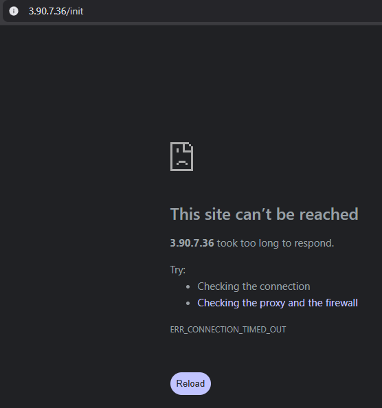

using journalctl -u rdsapp -n 100 --no-pager, the application crashed with:

KeyError: 'host'

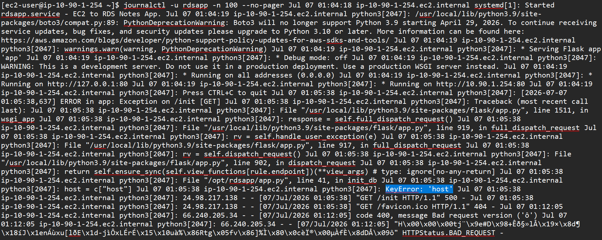

application expected the secret to include connection information that was not in the RDS secret.

application expects: host, username, password, port

Cause  
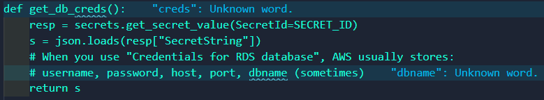
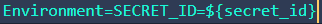

The AWS-managed secret only contained the database credentials, not the RDS endpoint.

Solution  
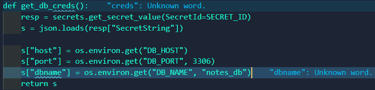
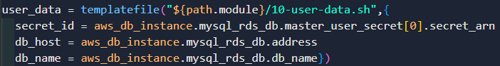
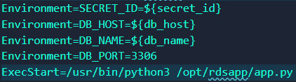

Passed the RDS endpoint, database name, and port separately through environment variables.

The templatefile() function allows Terraform to inject infrastructure values into the EC2 User Data script before the instance is launched

Lesson Learned

The RDS-managed secret contains authentication data. Connection information (endpoint, database name, port) comes from the RDS instance itself.

---

## Database Name Mismatch

Problem

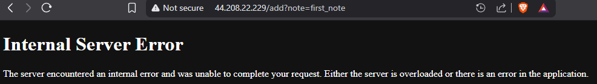

The /add endpoint failed after /init succeeded.

Cause

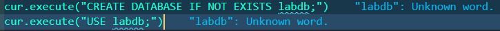

Terraform created:

notes_db

while the application used:

labdb

Solution

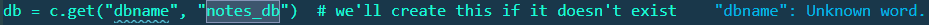
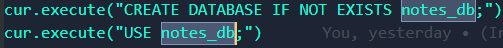

Standardized both Terraform and the application to use:

notes_db

Lesson Learned

Infrastructure and application configuration must use the same database name consistently.

---

## Terraform Provider Version Incompatibility

Problem  

terraform init failed because the AWS provider version you specified was no longer compatible.

Cause

The provider version constraint (~> 4.66.1) did not work with your Terraform environment.

Solution  

Updated the provider version to:

version = "6.52.0"

Lesson Learned

Always verify provider compatibility with the Terraform CLI version and AWS provider documentation.

---

## Git Not Detecting Files

Problem

git add . wasn't staging all files.

Cause

You were inside a child directory instead of the repository root.

Solution

Used:

git add -A

from the repository root.

Lesson Learned

Understand the difference between the current working directory and the repository root.

---

## GitHub Push Failed Due to Large Files

Problem

GitHub rejected git push.

Cause

The .terraform directory and provider binaries were accidentally committed.

Solution

Added a .gitignore/  
Removed tracked Terraform files/  

Used:
git add .

to correctly stage changes, from the proper directory and always add a .gitignore

Lesson Learned

Never commit:

.terraform/
terraform.tfstate
terraform.tfstate.backup

---

## Duplicate Route Table Entry

Problem

Terraform returned:

RouteAlreadyExists

error

Cause

The default route (0.0.0.0/0) was defined twice.

Solution

Removed the duplicate route.

Lesson Learned

AWS only allows one default route per route table.

---

## RDS Subnet Group Error

Problem

Terraform failed with:

InvalidParameterValue

about the DB subnet group.

Cause

The subnet group referenced subnets from a different VPC.

Solution

Created a new DB subnet group using the correct private subnets.

Lesson Learned

Every subnet in a DB subnet group must belong to the same VPC as the RDS instance.

---

## Terraform file() Function Error

Problem  
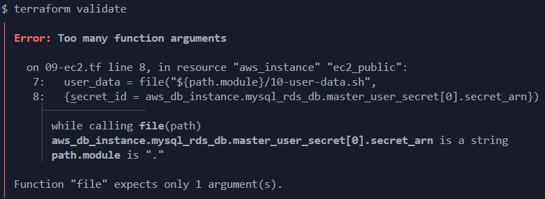

Terraform validation failed with:

Too many function arguments

Cause

Attempted to pass variables into:

file()

which only accepts a file path.

Solution  

Switched to:

templatefile()

Lesson Learned

file() reads a file./  
templatefile() reads a file and performs variable substitution.

---

## IAM AccessDeniedException

Problem

application returned:

500 Internal Server Error

Logs showed:

AccessDeniedException

Cause

The EC2 instance could assume its IAM role, but the role lacked permission to read the Secrets Manager secret.

Solution

Created an IAM policy granting:

secretsmanager:GetSecretValue

and attached it to the EC2 IAM role.

Lesson Learned

An IAM role's trust policy determines who can assume it; attached IAM policies determine what it can do.

---

## Incorrect Secret ID

Problem

The application was configured to use:

lab/rds/mysql

while Terraform created an AWS-managed RDS secret.

Cause

The secret name in the application did not match the generated secret.

Solution

Passed the generated secret ARN into the EC2 user-data using Terraform's templatefile().

Lesson Learned

When using:

manage_master_user_password = true

the application should use the AWS-generated secret instead of a hardcoded name.

---

## Security Group Verification

Problem

Suspected the Security Group was blocking EC2-to-RDS traffic.

Cause

The symptoms resembled a connectivity issue.

Solution

Reviewed the Security Groups and confirmed they allowed MySQL traffic. The actual issue was in the application configuration, not networking.

Lesson Learned

A 500 Internal Server Error indicates an application exception. Check the application logs before assuming it's a networking issue.

---

## Using System Logs to Debug

Problem

The application returned generic HTTP 500 errors.

Solution

Used:

systemctl status rdsapp\
journalctl -u rdsapp -n 100 --no-pager

to identify the exact Python exceptions.

Lesson Learned

Infrastructure issues and application issues produce similar symptoms. Read the application logs before changing cloud resources.

---

## Invalid cidr_ipv4 Value in Security Group Rule

Problem

Terraform validation failed with the following error:  
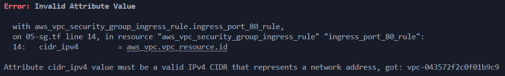

The cidr_ipv4 argument was incorrectly assigned the VPC ID (aws_vpc.vpc_resource.id) instead of a valid IPv4 CIDR block.

Solution  
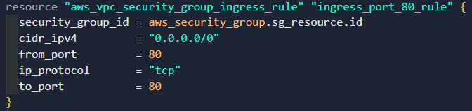  
Updated the Security Group rule to use a valid CIDR block of 0.0.0.0/0 instead of the VPC ID.

Lesson Learned

Terraform resource IDs and CIDR blocks serve different purposes.
Use .id when AWS expects a resource identifier (vpc_id, subnet_id, security_group_id).
Use .cidr_block or a CIDR rang ("0.0.0.0/0") when AWS expects an IP network.
Double check to verify the expected data type to prevent validation errors.

---

## Failed to create RDS

Problem

Terraform failed to create the RDS instance with the following error:
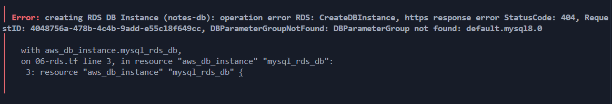
The RDS instance referenced a database parameter group that did not exist

Solution  

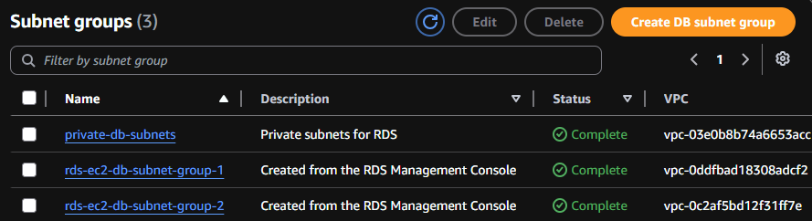

Created a DB Subnet Group using private subnets and referenced it in the RDS resource.

Used:

db_subnet_group_name = aws_db_subnet_group.rds_subnet_group.name

Lesson Learned

AWS will reject the configuration if only one subnet is configured, because the DB subnet group doesn't span at least two Availability Zones. The DB subnet group needs at least two subnets. The second subnet isn't necessarily used immediately, but it's required for proper RDS subnet group configuration

---

## Overall Lessons Learned

This project reinforced several important cloud engineering concepts:

- Read application logs before modifying infrastructure
- Verify IAM identity before modifying IAM permissions
- Keep Terraform infrastructure and application configuration the same
- Using secrets manager instead of hardcoded credentials is best practice
- Pass dynamic infrastructure values into applications using Terraform templates instead of hardcoding values
- Troubleshoot one layer of the architecture at a time instead of changing multiple components at the same time
