# AWS EC2-RDS Notes Application with Terraform

## Overview

This project demonstrates how to deploy a secure, three-tier AWS application using Terraform.

The application runs on an Amazon EC2 instance, securely stores its data in an Amazon RDS MySQL database, and retrieves database credentials dynamically from AWS Secrets Manager using an IAM Role attached to the EC2 instance.

The infrastructure follows AWS security best practices by isolating the database in a private subnet while exposing only the web application to the internet.

---

## Architecture

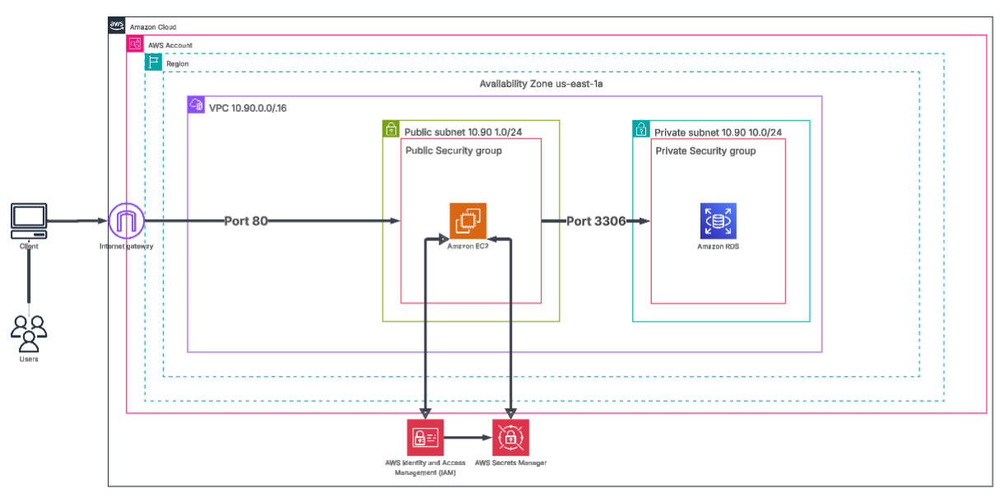

---

## Features

* Infrastructure provisioned entirely with Terraform
* Custom VPC with public and private subnets
* EC2-hosted Flask application
* Amazon RDS MySQL database
* IAM Role and Instance Profile for secure AWS authentication
* AWS Secrets Manager integration
* Dynamic configuration using Terraform `templatefile()`
* Automatic application deployment using EC2 User Data
* Least-privilege security model
* Documented troubleshooting and engineering decisions

---

## Technologies Used

### Cloud

* AWS
* Amazon EC2
* Amazon RDS
* Amazon VPC
* Internet Gateway
* Route Tables
* Security Groups
* IAM
* IAM Instance Profiles
* AWS Secrets Manager

### Infrastructure as Code

* Terraform

### Operating System

* Amazon Linux

### Application

* Python
* Flask
* boto3
* PyMySQL
* systemd

---

## Application Endpoints

`Initialize the database`

```b
http://<EC2_PUBLIC_IP>/init
```

`Insert a note`

```b
http://<EC2_PUBLIC_IP>/add?note=first_note
```

`Display stored notes`

```b
http://<EC2_PUBLIC_IP>/list
```

---

## Repository Structure

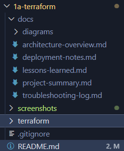

---

## Documentation

Additional project documentation can be found in the **docs** directory.

| Document                   | Description                                                              |
|----------------------------|--------------------------------------------------------------------------|
| `project-summary.md`       | Project objectives, AWS services used, workflow, and skills demonstrated |
| `architecture-overview.md` | Explanation of the AWS architecture and security model                  |
| `deployment-notes.md`      | Deployment steps, application endpoints, and cleanup instructions        |
| `troubleshooting-log.md`   | Issues encountered during development and their resolutions              |
| `lessons-learned.md`       | Engineering principles and key takeaways from the project                |
| `design-decisions.md`      | Reason behind architectural and implementation choices                   |

---

## Screenshots

### Terraform Deployment

`Terraform validate`  
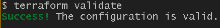

`Terraform plan`
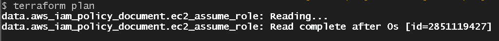


`Terraform apply -auto-approve`
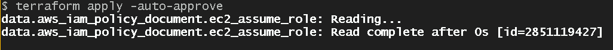
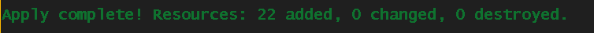

`Terraform destroy -auto-approve`  

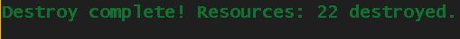

### AWS Infrastructure

`VPC`  
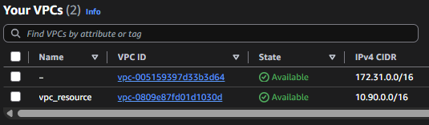

`SUBNETS`  
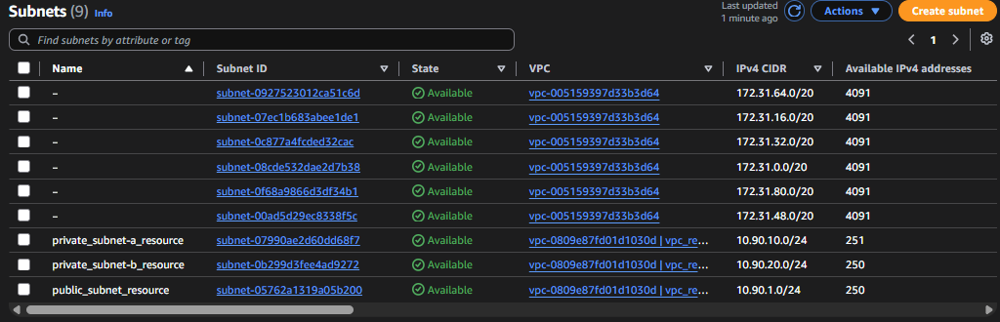
`SECURITY GROUPS`  
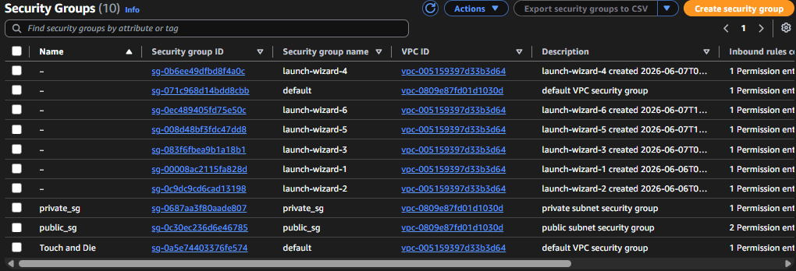
`EC2 INSTANCES`  
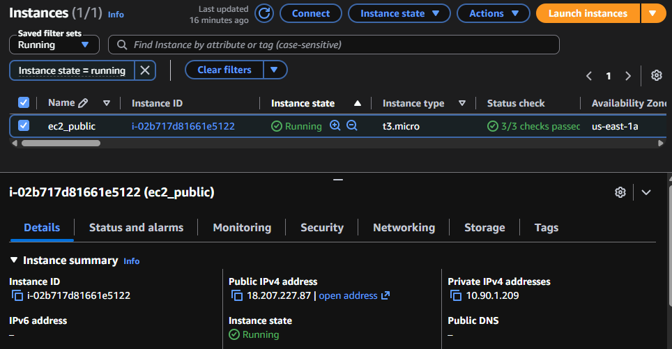
`DATABASES`  
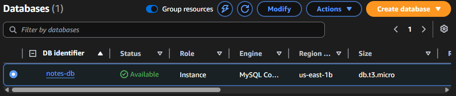

`EC2 IAM ROLES`
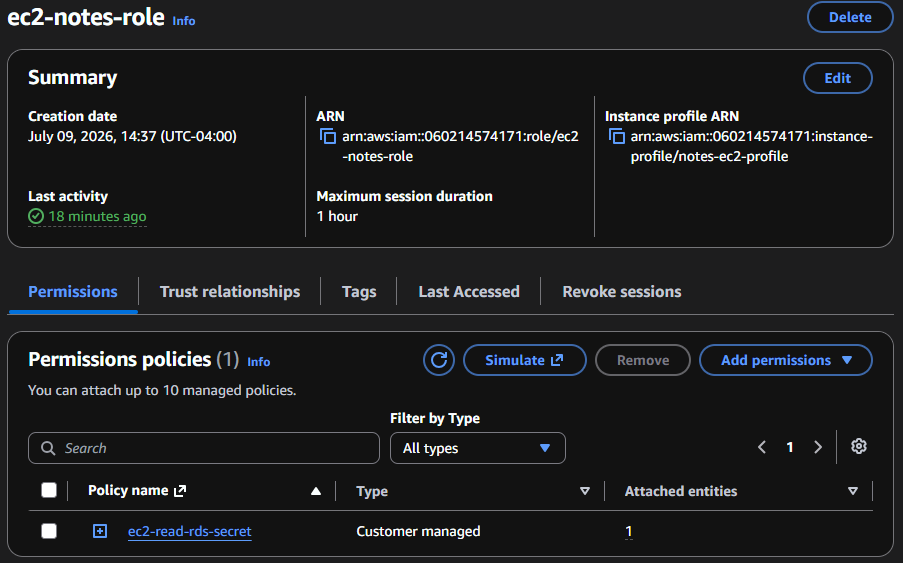

`EC2 IAM POLICIES`
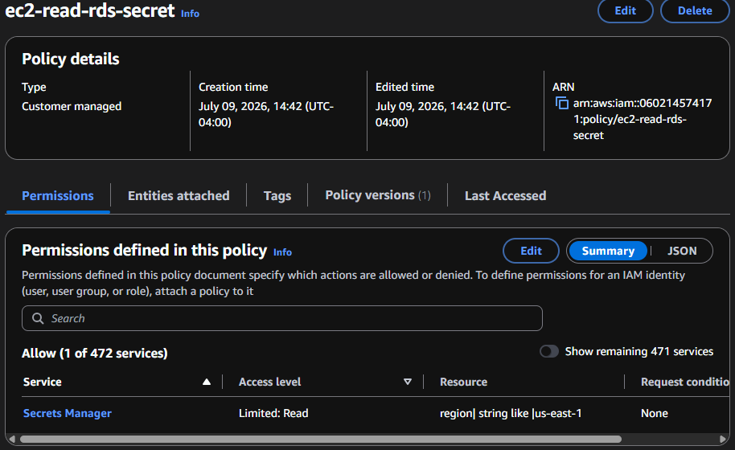

### Application End-Points

`Database initialization`  
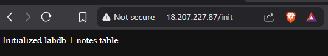

`Insert note`  
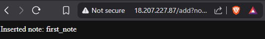

`List notes`  
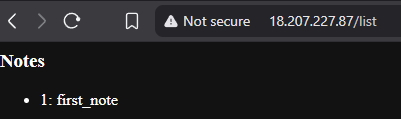

---

## Skills Demonstrated

* Infrastructure as Code (Terraform)
* AWS Networking
* Identity and Access Management (IAM)
* Secrets Management
* Linux Administration
* Infrastructure Automation
* Secure Cloud Architecture
* Database Administration
* Python Web Application Deployment
* Cloud Troubleshooting
* Infrastructure Debugging

---
