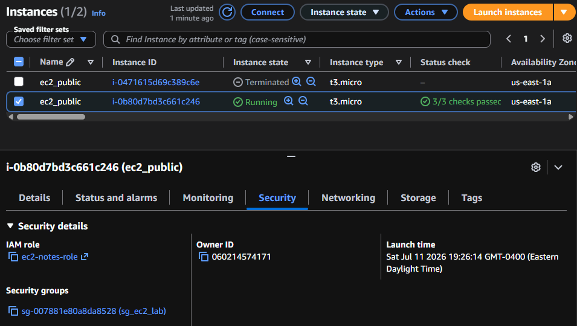
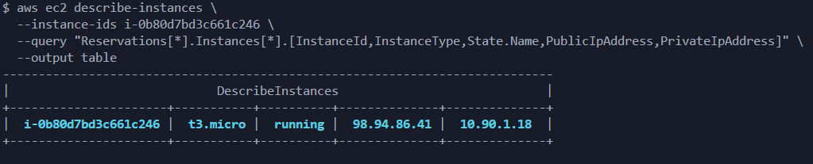
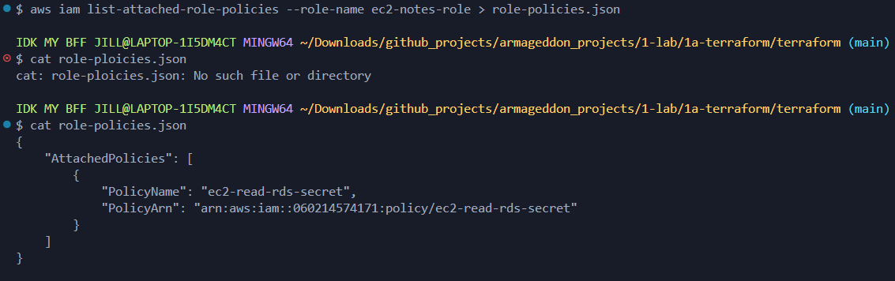

# Deliverables

1.
    - Screenshot of: RDS SG inbound rule using source = sg-ec2-lab
    

    - Screenshot of: EC2 role attached
    
    - Screenshot(2) of: EC2 role attached
    .png)

    - Screenshot of: /list output showing at least 3 notes  
    

2.  
    a) Why is DB inbound source restricted to the EC2 security group?  
        so that only the application server can connect to the database  

    b) What port does MySQL use?  
        MySQL uses TCP port 3306  

    c) Why is Secrets Manager better than storing creds in code/user-data?  
        because credentials are encrypted, can be rotated automatically, and are not exposed in repositories, EC2 metadata, or configuration files

3. Evidence for Audits / Labs (CLI Outputs)  
    - aws ec2 describe-security-groups  
    
    - aws rds describe-db-instances  
    
    - aws secretsmanager describe-secret
    
    - aws ec2 describe-instances
    
    - aws iam list-attached-role-policies
    

Then Answer: Response  

1. Why each rule exists  
2. What would break if removed  
3. Why broader access is forbidden  
4. Why this role exists  
5. Why it can read this secret  
6. Why it cannot read others

```s
Public Subnet  

    1. Why each rule exists  
subnet resources do not create permissions,they define the network layout, this public subnet exist because the database should never be directly reachable from the internet and only the EC2 application should communicate with it

    2. What would break if removed  
the ec2 instance would have nowhere to be deployed, without the public subnet the ec2 could not exist inside the VPC

    3. Why broader access is forbidden  
following principle of least privilege, not placing databases onto public networks decreases attack surface

    4. Why this role exists
subnet resources do not grant identities or permissions, no IAM Role is created here

    5. Why it can read this secret  
Subnets cannot read Secrets Manager, only an IAM Role with the appropriate policy can

    6. Why it cannot read others  
IAM policies determine which secrets can be accessed, subnets can not make API calls
```

```s
Private Subnets  

    1. Why each rule exists  
subnet resources do not create permissions,they define the network layout, these private subnets exist because Amazon RDS requires a DB Subnet Group containing subnets in at least two Availability Zones, even if using a Single-AZ database AWS still requires subnet groups that span multiple AZs

    2. What would break if removed  
AWS would reject the build with an error, if a database was running in the subnet that was removed, it would become unreachable because it no longer has a network interface, the ec2 application would fail to connect to MySQL throwing connection errors.

    3. Why broader access is forbidden  
following principle of least privilege, placing databases onto private networks decreases attack surface, this subnet should remain private because it is reserved for backend infrastructure resources that should not have direct Internet access

    4. Why this role exists
subnet resources do not grant identities or permissions, no IAM Role is created here

    5. Why it can read this secret  
Subnets cannot read Secrets Manager, only an IAM Role with the appropriate policy can

    6. Why it cannot read others  
IAM policies determine which secrets can be accessed, subnets can not make API calls
```

```s
Internet Gateway

    1. Why each rule exists  
Internet Gateway resources do not create permissions. the Internet Gateway provides a path between the VPC and the public internet, so resources can send or receive internet traffic

    2. What would break if removed  
access to the website would fail, SSH and HTTP request from anywhere would fail. EC2 instance would no longer be able to install packages using dnf, download Python libraries using pip or download any updates. public route to the internet gateway would fail.

    3. Why broader access is forbidden  
Internet Gateway does not grant permissions, it does not authenticate users, authorize requests or filter traffic, it only forwards packets according to the VPC routing configuration

    4. Why this role exists  
Internet Gateways create no IAM role

    5. Why it can read this secret  
Internet Gateways never communicate with Secrets Manager

    6. Why it cannot read others
not applicable
```

```s
Route Table

    1. Why each rule exists  
Route Tables do not grant permissions to users or services, they control network routing

    2. What would break if removed  
subnets would lose their custom routes and fall back to the VPCs main route table if one exists, the EC2 instance could not reach the Internet, users could not reach the EC2 web server, software installation during application would fail

    3. Why broader access is forbidden  
Route Table does not grant permissions, it controls packet routing

    4. Why this role exists  
Route Tables create no IAM role, it provides a place to define network routes so AWS knows how traffic should leave the subnet

    5. Why it can read this secret  
Route Tables never interact with Secrets Manager

    6. Why it cannot read others
Networking resources do not access AWS Secrets

```

```s
Public Security Group

    1. Why each rule exists  
rule 1) Ingress TCP 80 CIDR 0.0.0.0/0 - the application listens on port 80 and traffic arrives on port 80, allowing all users on the internet to reach the application by visiting http://<EC2 Public IP>
rule 2) Ingress TCP 22 CIDR 0.0.0.0/0 - allows SSH access, lets administrators log into the EC2 instance to troubleshoot, view logs, updating software and test connectivity
rule 3)  Egress All protocols 0.0.0.0/0 - ec2 instance needs outbound connectivity, download packages with dnf, install Python libraries with pip

    2. What would break if removed  
under rule 1) the EC2 instance would still be running, but every browser request would time out, no user could access /init, /add, /list
under rule 2) SSH access would be lost, administrators would lose access to log into the EC2 instance to troubleshoot, view logs, updating software and test connectivity
under rule 3) ec2 could not install Flask, install boto3, install PyMySQL and download updates, the application would fail at runtime

    3. Why broader access is forbidden  
under rule 1) Opening more ports would unnecessarily expose services that do not exist and increase attack surface
under rule 2) follows principle of least privilege, no reason for remote users to access every service
under rule 3) it allows the broadest of access

    4. Why this role exists  
Inapplicable
    5. Why it can read this secret  
Inapplicable
    6. Why it cannot read others
Inapplicable
```

```s
Private Security Group

    1. Why each rule exists  
rule 1) Ingress TCP 3306 referenced_security_group_id = aws_security_group.sg_ec2_lab.id - MySQL communicates on port 3306, this rule trusts any instance that belongs to the ec2 security group because only the ec2 instance should have access the database and makes the security group reference dynamic. if the ec2 instance stopped then recreated, the IP address will change. the rule trusts the security group so communication continues without updating firewall rules, making infrastructure more resilient and easier to maintain. The database also needs to send responses back to the ec2 instance after receiving requests

    2. What would break if removed  
the database would still exist, but the application would fail to connect to RDS and receive cant connect to MySQL server error

    3. Why broader access is forbidden  
principle of least privilege, it is more secure to only allow ec2 security group rather than allowing any computer on the internet and exposes the database to unnecessary risk

    4. Why this role exists  
Inapplicable
    5. Why it can read this secret  
Inapplicable
    6. Why it cannot read others
Inapplicable
```

```s
RDS Database

    1. Why each rule exists  
rule 1) publicly_accessible = false - Prevents the database from receiving a public IP address

rule 2) db_subnet_group_name = aws_db_subnet_group.rds_subnet_group.name - tells RDS which private subnets it may use

rule 3) vpc_security_group_ids = [aws_security_group.sg_private_resource.id] - to control who may connect to MySQL

rule 4) manage_master_user_password = true - instead of hardcoding passwords,AWS generates one automatically stores the password inside Secrets Manager and the ec2 retrieves it using IAM

Your EC2 application retrieves it using IAM

    2. What would break if removed  
under rule 1) someone on the internet could attempt to connect
you would have to hard code credentials, storing them in terraform, creating a security risk

under rule 2) if removed before terraform apply it would fail to create, if removed while running nothing until terraform compares terraform configuration with aws infrastructure 

under rule 3) the connection from ec2 to rds would fail

under rule 4) the password would need to be hardcoded, making a security risk because it is store in terraform

    3. Why broader access is forbidden  
under rule 1) Databases should never be Internet-facing because increased attack surface resulting in vulnerability scanning, password attacks and compliance requirements

under rule 2) If public subnets were allowed, the database could become reachable through the internet

under rule 3) preventing anyone on the internet from attempting to login, avoiding attacker that could continuously attempt to login and stay with the best practice of principle of least privilege

under rule 4) because principle of least privilege, credentials should only be readable by systems that actually need it, If every ec2 instance or IAM user could read it they could connect directly to the production database

    4. Why this role exists  
Inapplicable
    5. Why it can read this secret  
Inapplicable
    6. Why it cannot read others
Inapplicable
```

```s
Database Subnet Group

    1. Why each rule exists  

    2. What would break if removed  

    3. Why broader access is forbidden  

    4. Why this role exists  

    5. Why it can read this secret  

    6. Why it cannot read others

```

```s
IAM

    1. Why each rule exists  

    2. What would break if removed  

    3. Why broader access is forbidden  

    4. Why this role exists  

    5. Why it can read this secret  

    6. Why it cannot read others

```

```s
EC2

    1. Why each rule exists  

    2. What would break if removed  

    3. Why broader access is forbidden  

    4. Why this role exists  

    5. Why it can read this secret  

    6. Why it cannot read others

```

```s
Internet Gateway

    1. Why each rule exists  

    2. What would break if removed  

    3. Why broader access is forbidden  

    4. Why this role exists  

    5. Why it can read this secret  

    6. Why it cannot read others

```
