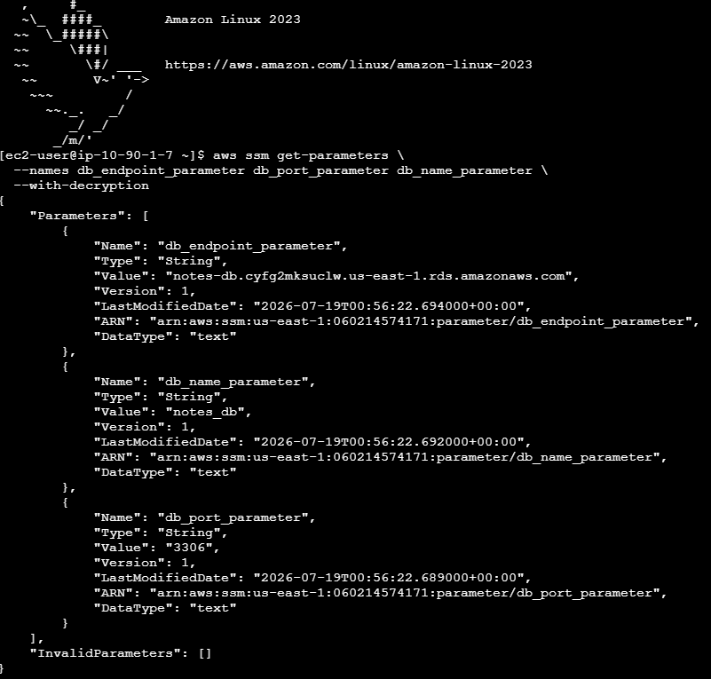
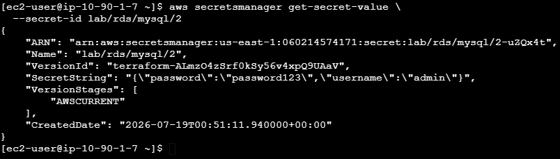
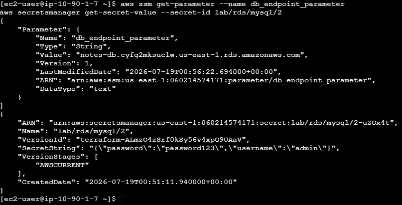
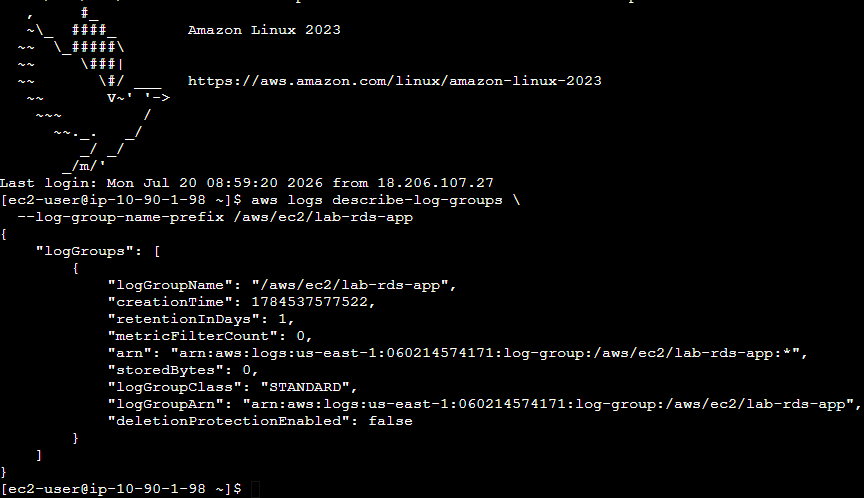
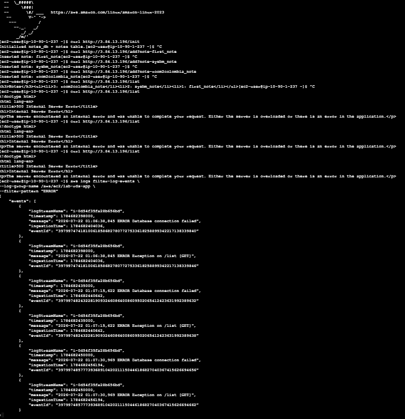
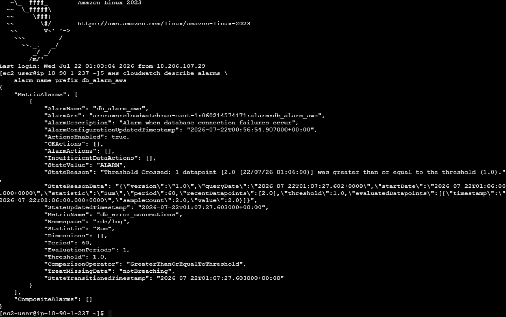
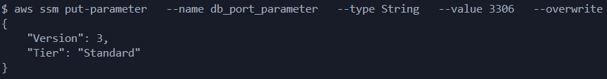
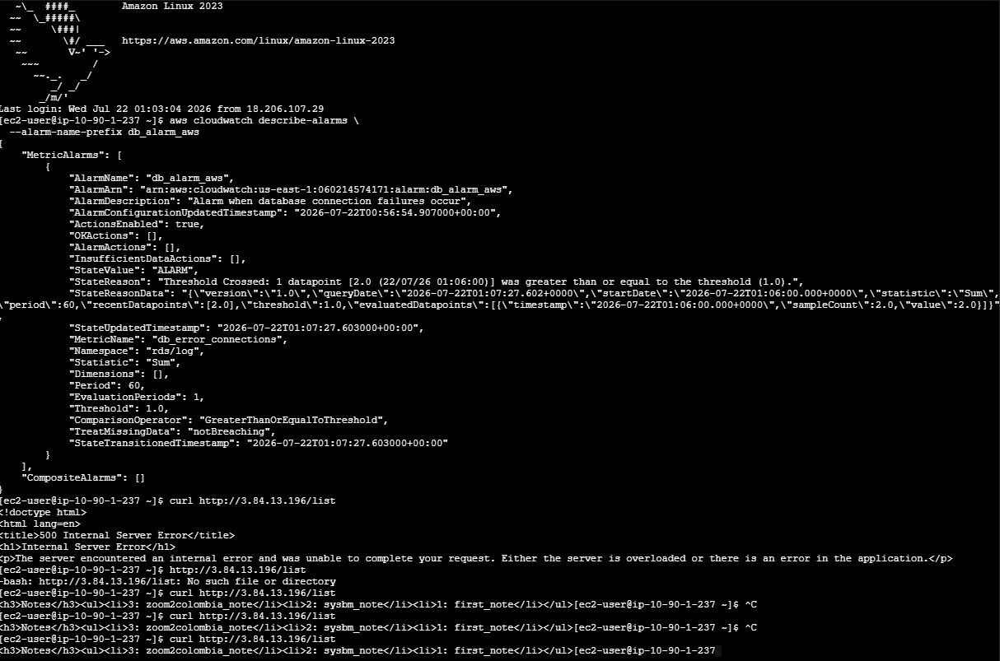

# Technical Verification Deliverables

7.1 Verify Parameter Store Values

aws ssm get-parameters \
  --names /lab/db/endpoint /lab/db/port /lab/db/name \
  --with-decryption

7.2 Verify Secrets Manager Value

  aws secretsmanager get-secret-value \
  --secret-id lab/rds/mysql

7.3 Verify EC2 Can Read Both Systems From EC2:

aws ssm get-parameter --name db_endpoint_parameter  
aws secretsmanager get-secret-value --secret-id lab/rds/mysql

7.4 Verify CloudWatch Log Group Exists

aws logs describe-log-groups \
  --log-group-name-prefix /aws/ec2/lab-rds-app

7.5 Verify DB Failure Logs Appear Simulate failure (examples): Stop RDS Change DB password in Secrets Manager without updating DB Block SG temporarily

Then check logs:

aws logs filter-log-events \
  --log-group-name /aws/ec2/lab-rds-app \
  --filter-pattern "ERROR"

7.6 Verify CloudWatch Alarm

aws cloudwatch describe-alarms \
  --alarm-name-prefix lab-db-connection

7.7 Incident Recovery Verification After restoring correct credentials or connectivity:

Incident Recovery Verification:

  

curl <http://3.84.13.196/list>  

