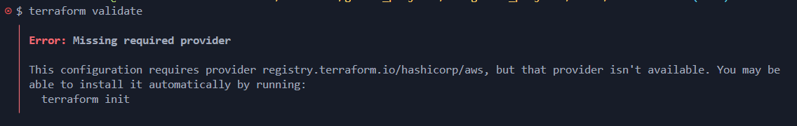
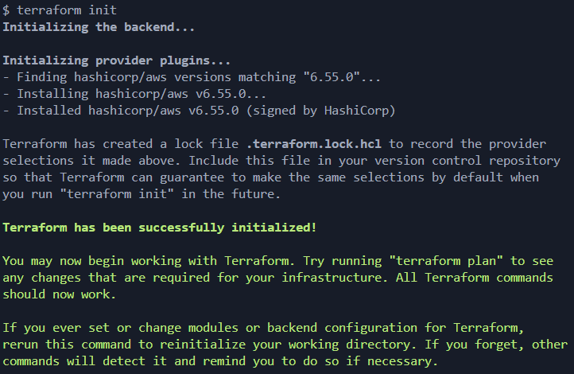
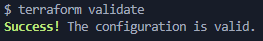
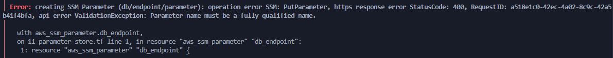
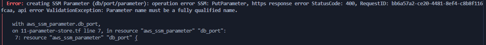
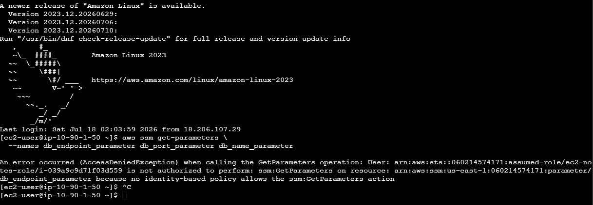
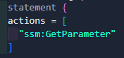
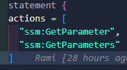
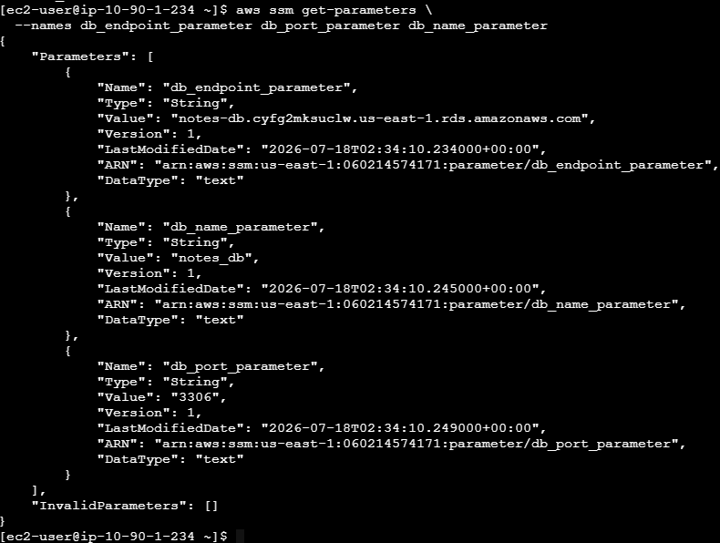

# Trouble Shooting Log

## Error: 1

 Missing required provider

> Problem:
Forgot to run terraform init  

> Solution:
Ran terraform init then terraform validate  

---

---

## Error: 2

 creating SSM Parameter (db/endpoint/parameter): operation error SSM: PutParameter, https response error StatusCode: 400, RequestID: a518e1c0-42ec-4a02-8c9c-42a5b41f4bfa, api error ValidationException: Parameter name must be a fully qualified name

> Problem:

> Solution:

---

---

## Error: 3

 creating SSM Parameter (db/port/parameter): operation error SSM: PutParameter, https response error StatusCode: 400, RequestID: bb6a57a2-ce20-4481-8ef4-c8b8f116fcaa, api error ValidationException: Parameter name must be a fully qualified name

> Problem:

> Solution:

---

---

## Error: 4

 creating SSM Parameter (db/name/parameter): operation error SSM: PutParameter, https response error StatusCode: 400, RequestID: 46e5caa0-1e0c-469a-8263-99010f93a51b, api error ValidationException: Parameter name must be a fully qualified name

> Problem:

> Solution:

---

---

## Error: 5

[ec2-user@ip-10-90-1-50 ~]$ aws ssm get-parameters \
  --names db_endpoint_parameter db_port_parameter db_name_parameter

An error occurred (AccessDeniedException) when calling the GetParameters operation: User: arn:aws:sts::060214574171:assumed-role/ec2-notes-role/i-039a9c9d71f03d559 is not authorized to perform: ssm:GetParameters on resource: arn:aws:ssm:us-east-1:060214574171:parameter/db_endpoint_parameter because no identity-based policy allows the ssm:GetParameters action
[ec2-user@ip-10-90-1-50 ~]$  

> Problem:
missing "ssm:GetParameters" in file 11, under actions in  "aws_iam_policy_document" "ec2_secrets_policy"  

---
> Solution: added ssm:getparameters

  
  

---

---

## Error: ---

> Problem:

> Solution:

---

---

## Error: ---

> Problem:

> Solution:

---

---

## Error: ---

> Problem:

> Solution:

---

---

## Error: ---

> Problem:

> Solution:

---

---

## Error: ---

> Problem:

> Solution:

---

---

## Error: ---

> Problem:

> Solution:

---

---

## Error: ---

> Problem:

> Solution:

---
