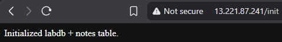
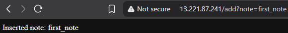
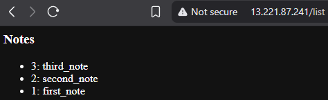
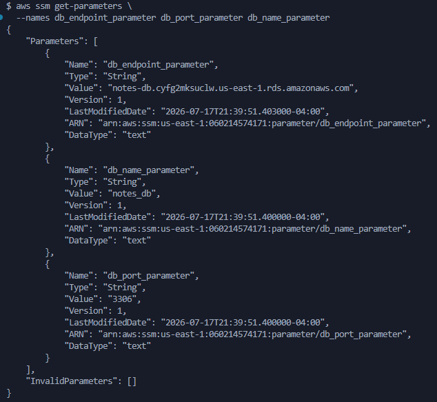
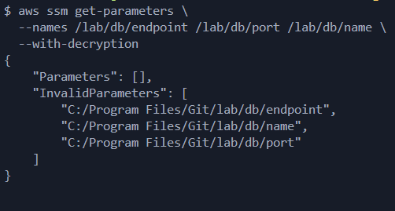
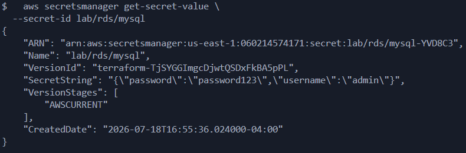

# Validation Doc (documenting what and when resources work)

Terraform files 00-09 and user-data.sh works in 1b-terraform/terraform/

$ terraform validate  
Success! The configuration is valid.

$ terraform plan  
data.aws_iam_policy_document.ec2_assume_role: Reading...  
data.aws_iam_policy_document.ec2_assume_role: Read complete after 0s [id=2851119427]  
Plan: 22 to add, 0 to change, 0 to destroy.  

$ terraform apply -auto-approve  
data.aws_iam_policy_document.ec2_assume_role: Reading...  
data.aws_iam_policy_document.ec2_assume_role: Read complete after 0s [id=2851119427]  
Apply complete! Resources: 22 added, 0 changed, 0 destroyed.  

---

Application Endpoints, work:

```s
http://13.221.87.241/init

http://13.221.87.241/add?note=first_note

http://13.221.87.241/list
```





---
$ terraform destroy -auto-approve  
Destroy complete! Resources: 22 destroyed.  

---

Terraform files 00-11 and user-data.sh works in 1b-terraform/terraform/

$ terraform validate  
Success! The configuration is valid.

$ terraform apply -auto-approve  
Apply complete! Resources: 25 added, 0 changed, 0 destroyed.  

---
$ aws ssm get-parameters \
  --names db_endpoint_parameter db_port_parameter db_name_parameter



---

```s
> added to user_data.sh  

ssm = boto3.client("ssm", region_name=REGION)

def get_parameter(name):
    response = ssm.get_parameter(Name=name)
    return response["Parameter"]["Value"]

cur.execute(f"USE `{db}`;")
cur.execute(f"CREATE DATABASE IF NOT EXISTS `{db}`;")

db = c["dbname"]

port = int(c["port"])

return f"Initialized {db} + notes table."


> removed from user_data.sh  

Environment=DB_HOST=${db_host}
Environment=DB_NAME=${db_name}
Environment=DB_PORT=3306

cur.execute("CREATE DATABASE IF NOT EXISTS notes_db;")
cur.execute("USE notes_db;")

db = c.get("dbname", "notes_db") 

port = int(c.get("port", 3306))

return "Initialized labdb + notes table."
```

```s
> removed from file 9

db_host = aws_db_instance.mysql_rds_db.address

db_name = aws_db_instance.mysql_rds_db.db_name

secret_id = aws_db_instance.mysql_rds_db.master_user_secret[0].secret_arn

> added to file 9

secret_id = aws_secretsmanager_secret.rds_secret.name
```

```s
> removed from file 8

aws_db_instance.mysql_rds_db.master_user_secret[0].secret_arn

> added to file 8

aws_secretsmanager_secret.rds_secret.arn
```

```s
> removed from file 6

  manage_master_user_password = true

> added to file 6

  manage_master_user_password = false (deleted)
```

---

7.1 Verify Parameter Store Values

aws ssm get-parameters \
  --names /lab/db/endpoint /lab/db/port /lab/db/name \
  --with-decryption



7.2 Verify Secrets Manager Value

  aws secretsmanager get-secret-value \
  --secret-id lab/rds/mysql



7.3 Verify EC2 Can Read Both Systems From EC2:

aws ssm get-parameter --name db_endpoint_parameter
aws secretsmanager get-secret-value --secret-id lab/rds/mysql


