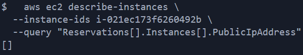
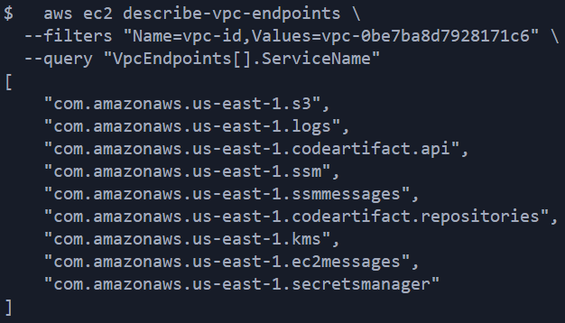
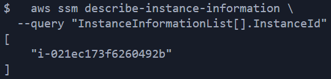
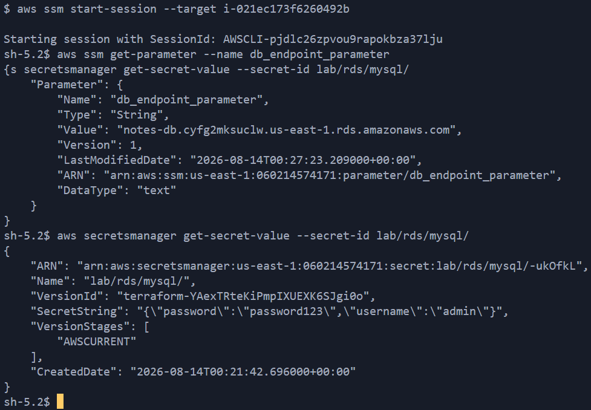
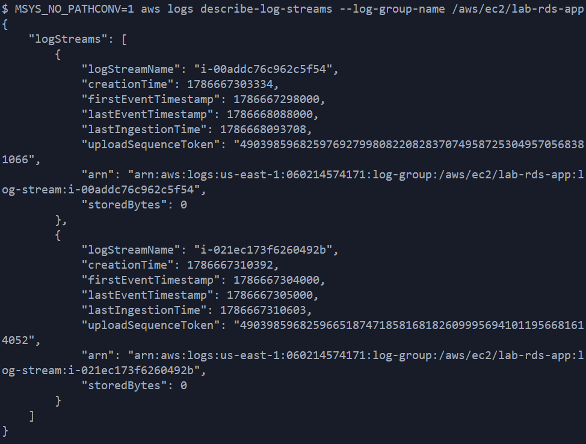

# Lab 1c Bonus-A — Troubleshooting Log / Runbook / Bonus A Verification

**Project:** AWS Portfolio — EC2/RDS Notes App, Private Networking Extension
**Purpose:** Every real failure hit while building and verifying Bonus-A, in the order encountered, with root cause and resolution for each — modeled on the Lab 1b incident-response runbook format.

## Problem 2 — Interface Endpoints Rejected: DNS Support Not Enabled

**Symptom:**
```
Error: creating EC2 VPC Endpoint (com.amazonaws.us-east-1.secretsmanager):
api error InvalidParameter: Enabling private DNS requires both enableDnsSupport
and enableDnsHostnames VPC attributes set to true for <VPC_ID>
```
(repeated across all 6 interface endpoints — ssm, ec2messages, ssmmessages, logs, secretsmanager, kms)

**Root cause:** The original Lab 1a VPC (`01-vpc.tf`) never set `enable_dns_support` or `enable_dns_hostnames`. Both are required for `private_dns_enabled = true` on any interface endpoint.

**Resolution:** Added both attributes to the VPC resource:
```hcl
resource "aws_vpc" "vpc_resource" {
  cidr_block           = "10.90.0.0/16"
  enable_dns_support   = true
  enable_dns_hostnames = true
  ...
}
```

**Verification:**
```bash
aws ec2 describe-vpc-attribute --vpc-id <VPC_ID> --attribute enableDnsSupport
aws ec2 describe-vpc-attribute --vpc-id <VPC_ID> --attribute enableDnsHostnames
```
**Expected:** both return `"Value": true`.

---

## Problem 3 — IAM Race Condition: AccessDeniedException on First Boot

**Symptom (from `/var/log/cloud-init-output.log` on the public EC2):**
```
An error occurred (AccessDeniedException) when calling the GetParameter operation:
User: arn:aws:sts::<ACCOUNT_ID>:assumed-role/ec2-notes-role/<INSTANCE_ID> is not
authorized to perform: ssm:GetParameter on resource:
arn:aws:ssm:us-east-1:<ACCOUNT_ID>:parameter/cloudwatch_agent_parameter
Waiting for SSM parameter access...
```
(repeats indefinitely — the `until` loop in user-data never exits)

**Downstream effect:**
```bash
systemctl status rdsapp
```
```
Unit rdsapp.service could not be found.
```
The app's systemd unit is never written because user-data hangs on the CloudWatch agent config fetch — every step after it (writing `app.py`, creating the service) never runs.

**Root cause:** `aws_instance.ec2_public` referenced `aws_iam_instance_profile.ec2_profile.name`, and the instance profile referenced the *role* — but nothing in that chain referenced `aws_iam_role_policy_attachment.attach_secret_policy`. Terraform had no dependency edge forcing the policy attachment to finish before the instance launched, so the instance could (and did) boot before its own IAM permissions were actually attached.

**Resolution:** Added explicit `depends_on` to both EC2 resources:
```hcl
resource "aws_instance" "ec2_public" {
  ...
  depends_on = [aws_iam_role_policy_attachment.attach_secret_policy]
}
```
```hcl
resource "aws_instance" "ec2_private" {
  ...
  depends_on = [
    aws_iam_role_policy_attachment.attach_secret_policy_private,
    aws_iam_role_policy_attachment.attach_ssm_managed_policy,
    aws_iam_role_policy.codeartifact_access
  ]
}
```


```bash
aws ssm get-parameter --name cloudwatch_agent_parameter --query Parameter.Value --output text
```
**Expected:** returns the JSON config value, no `AccessDeniedException`.

---

## Problem 4 — Public EC2 API Calls Time Out After Adding VPC Endpoints

**Symptom (from `/var/log/cloud-init-output.log`, same instance, after Problem 3 was fixed):**
```
Connect timeout on endpoint URL: "https://ssm.us-east-1.amazonaws.com/"
Waiting for SSM parameter access...
```
`dnf` and `pip3 install` succeed cleanly (confirming general internet access still works) — only AWS API calls fail.

**Root cause:** `private_dns_enabled = true` on the interface endpoints overrides DNS resolution for AWS service hostnames (`ssm.us-east-1.amazonaws.com`, `secretsmanager...`, etc.) for the **entire VPC**, not just the private subnets the endpoint ENIs sit in. The public EC2 instance started resolving these hostnames to the endpoints' private IPs — but `sg_vpc_endpoints` only allowed inbound 443 from the private instance's security group, so the (unknowingly redirected) request was silently dropped by the security group.

**Resolution:** Added a second ingress rule to `sg_vpc_endpoints` allowing the public instance's SG too:
```hcl
resource "aws_vpc_security_group_ingress_rule" "ingress_443_from_public_ec2" {
  security_group_id            = aws_security_group.sg_vpc_endpoints.id
  referenced_security_group_id = aws_security_group.sg_ec2_lab.id
  from_port                    = 443
  ip_protocol                  = "tcp"
  to_port                      = 443
}
```
No instance replacement needed — security group changes apply immediately to the existing ENI.

**Verification:**
```bash
curl http://<EC2_PUBLIC_IP>/init
```
**Expected:** `Initialized notes_db + notes table`, no connection failure.

---

## Problem 5 — RDS Security Group Only Allowed the Public Instance

**Root cause:** `05-sg.tf`'s ingress rule on `sg_private_resource` (RDS) only referenced `sg_ec2_lab`. The newly created private instance's security group wasn't in the allow-list, so it couldn't reach RDS on 3306 even though everything else was correctly configured.

**Resolution:** Added a second ingress rule:
```hcl
resource "aws_vpc_security_group_ingress_rule" "ingress_port_3306_rule_private" {
  security_group_id            = aws_security_group.sg_private_resource.id
  referenced_security_group_id = aws_security_group.sg_ec2_private_bonus_a.id
  from_port                    = 3306
  ip_protocol                  = "tcp"
  to_port                      = 3306
}
```

---

## Problem 6 — `describe-log-streams` Fails with a Regex Validation Error

**Symptom:**
```bash
aws logs describe-log-streams --log-group-name /aws/ec2/lab-rds-app
```
```
aws: [ERROR]: An error occurred (InvalidParameterException) when calling the
DescribeLogStreams operation: 1 validation error detected: Value at
'logGroupName' failed to satisfy constraint: Member must satisfy regular
expression pattern: [\.\-_/#A-Za-z0-9]+
```
...even though `aws logs describe-log-groups` confirmed the log group name was exactly `/aws/ec2/lab-rds-app`.

**Root cause:** Shell environment (Git Bash / MSYS on Windows), not AWS. MSYS silently rewrites any CLI argument that starts with `/` before it reaches the `aws` binary — treating it as a filesystem path to convert. `echo` doesn't reveal this because it's a shell builtin, not subject to the same argument-rewriting applied when handing arguments to an external program.

**Diagnosis:**
```bash
MSYS_NO_PATHCONV=1 aws logs describe-log-streams --log-group-name /aws/ec2/lab-rds-app
```

**Expected (healthy):**
```json
{
    "logStreams": [
        {
            "logStreamName": "<INSTANCE_ID>",
            ...
        }
    ]
}
```
One log stream per instance ID that has sent data through the CloudWatch agent.

**Resolution:** Prefix any AWS CLI command whose argument starts with `/` (log group names, SSM parameter paths, etc.) with `MSYS_NO_PATHCONV=1` when running in Git Bash on Windows.

---

## Verification Checklist

1) Private EC2 has no public IP
All five checks below were run after the fixes above and confirmed passing:


2) All 8 VPC endpoints exist (6 interface + s3 gateway + codeartifact split into 2)


3) Session Manager path works, no SSH


4) Instance can read both config stores (ran from SSM session)


5) CloudWatch Logs delivery path is live


---

## Lessons Learned

- **Terraform's dependency graph only knows what you tell it.** An instance profile referencing a role does *not* imply the role's policy attachments are finished — if nothing references the attachment resource directly, add `depends_on` explicitly.
- **`private_dns_enabled` on an interface endpoint is VPC-scoped, not subnet-scoped.** Adding endpoints for "just the private subnet" can silently break unrelated instances elsewhere in the same VPC that call the same AWS services.
- **A CLI error that doesn't match the actual input value is a clue, not a dead end.** The regex validation error pointed at "the string I received doesn't match" — the fix was proving what string the CLI actually received (`echo` vs. testing with `MSYS_NO_PATHCONV`), not re-reading the regex.
- **State/reality drift (Problem 1) is a different failure class than a code bug** — always check `terraform state list` before assuming a "duplicate resource" error means the `.tf` file is wrong.