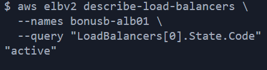
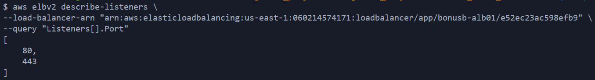
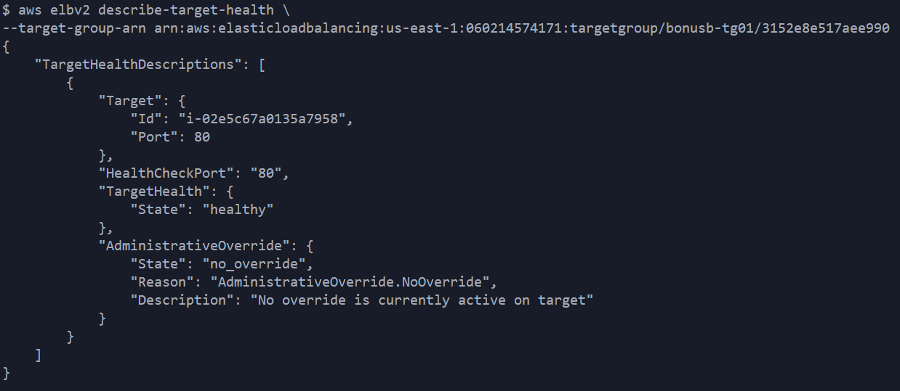
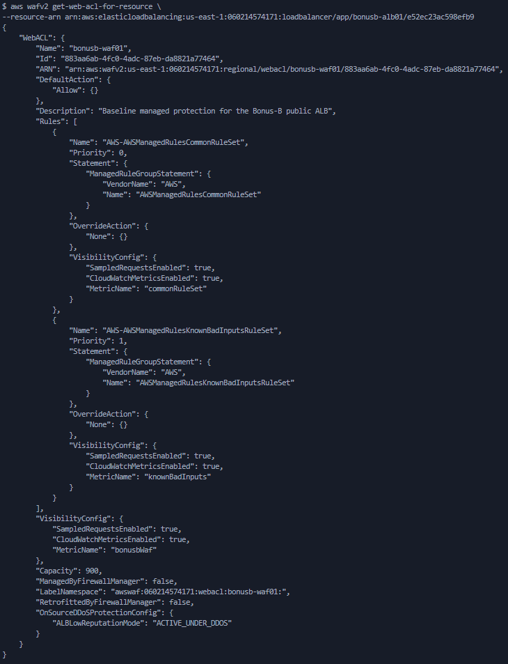
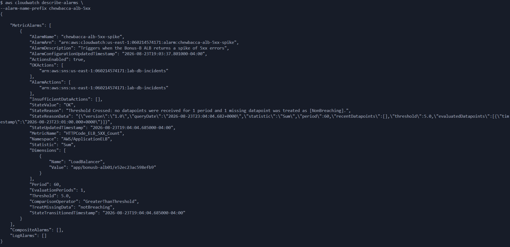
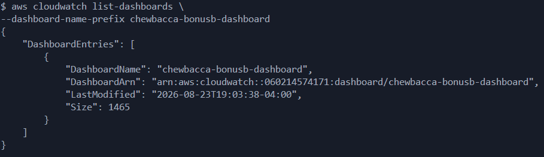
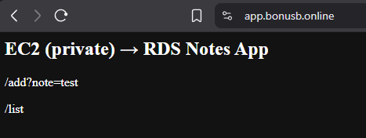

# Bonus-B Technical Verification

This document records the verification steps for Lab 1C Bonus-B — the public
ALB, TLS/ACM, WAF, CloudWatch dashboard, and SNS 5xx alarm layer built in
front of the private EC2 from Lab 1C / Bonus-A.

Live domain: `https://app.bonusb.online`

---

## 1. ALB exists and is active

```bash
aws elbv2 describe-load-balancers \
  --names bonusb-alb01 \
  --query "LoadBalancers[0].State.Code"
```

**Expected result:** `"active"`

**Actual result:** `"active"`



---

## 2. HTTPS listener exists on 443

```bash
aws elbv2 describe-listeners \
  --load-balancer-arn arn:aws:elasticloadbalancing:us-east-1:060214574171:loadbalancer/app/bonusb-alb01/8f5035fb0edf646e \
  --query "Listeners[].Port"
```

**Expected result:** `[80, 443]` (80 redirects to 443; 443 terminates TLS with the ACM cert for `app.bonusb.online`)

**Actual result:** `[80, 443]`



---

## 3. Target is healthy

```bash
aws elbv2 describe-target-health \
  --target-group-arn arn:aws:elasticloadbalancing:us-east-1:060214574171:targetgroup/bonusb-tg01/f6a1d0cbafe76ca0
```

**Expected result:** `TargetHealth.State` = `"healthy"`

**Actual result:** `"healthy"` (target: `i-0377304cf47c4dda0`, port 80)



---

## 4. WAF attached

```bash
aws wafv2 get-web-acl-for-resource \
  --resource-arn arn:aws:elasticloadbalancing:us-east-1:060214574171:loadbalancer/app/bonusb-alb01/8f5035fb0edf646e
```

**Expected result:** returns the `bonusb-waf01` Web ACL (not empty)

**Actual result:** `bonusb-waf01` returned, with `AWSManagedRulesCommonRuleSet` and `AWSManagedRulesKnownBadInputsRuleSet` active



---

## 5. Alarm created (ALB 5xx)

```bash
aws cloudwatch describe-alarms \
  --alarm-name-prefix chewbacca-alb-5xx
```

**Expected result:** `chewbacca-alb-5xx-spike` alarm listed, wired to the existing incident-response SNS topic (`lab-db-incidents`)

**Actual result:** alarm present, `StateValue: "OK"`, `AlarmActions` and `OKActions` both pointing at `arn:aws:sns:us-east-1:060214574171:lab-db-incidents`



---

## 6. Dashboard exists

```bash
aws cloudwatch list-dashboards \
  --dashboard-name-prefix chewbacca
```

**Expected result:** `chewbacca-bonusb-dashboard` listed

**Actual result:** listed, `LastModified` confirmed, 4 widgets (request count, target response time, healthy/unhealthy host count, 4xx/5xx errors)



---

## 7. End-to-end HTTPS check (manual, browser)

Navigate to `https://app.bonusb.online` and confirm:
- Valid TLS certificate (padlock, no browser warnings)
- Flask app homepage loads (`EC2 (private) → RDS Notes App`)

**Actual result:** loads successfully. First request after `terraform apply`
returned an intermittent `502 Bad Gateway` despite a healthy target; resolved
on refresh. Likely cause: Flask's Werkzeug dev server (`app.run()`) does not
handle the ALB's persistent/keep-alive connections as cleanly as a production
WSGI server would — noted as a follow-up hardening item, not a Bonus-B
architecture defect.



---

## Summary

| # | Check | Result |
|---|-------|--------|
| 1 | ALB active | ✅ Pass |
| 2 | HTTPS listener on 443 | ✅ Pass |
| 3 | Target healthy | ✅ Pass |
| 4 | WAF attached | ✅ Pass |
| 5 | 5xx alarm exists | ✅ Pass |
| 6 | Dashboard exists | ✅ Pass |
| 7 | HTTPS end-to-end | ✅ Pass (intermittent 502 on cold start, resolved on retry) |